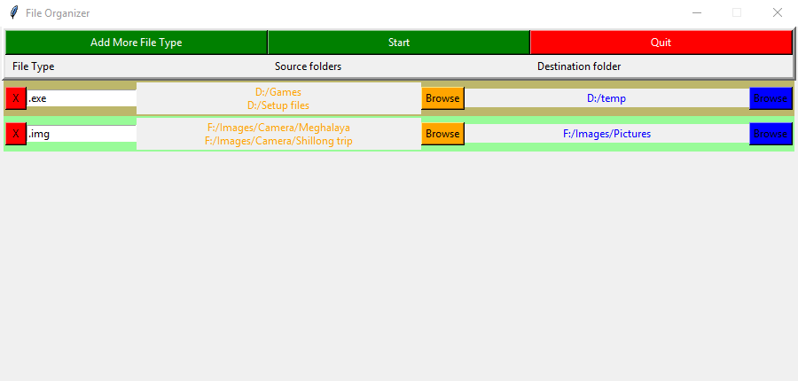

# File-Organizer
This is a GUI based application which can efficiently scan multiple directories and store files into multiple destination (each destination as a seperate entry) based on thier extensions.

# Uses
Lets say you have a download folder, and all your movies, songs, documents are in it. You want to have them seperated into different folders, but don't have much time to do so. All you need to run is this script, select the download folder as source, and put in relevant details and this application will get it done for you.

The main feature of this tool is that you can choose multiple directories at same time, and multiple source destinations (each destination as a seperate entry) to move your files too. And the application gets it done without using multiple hard-disk scan, and hence it more efficient and saves times.

# TODO
Add filters to select files based on thier name and size, modification date.
Make executable files for different platforms. 

# Issue
Make the GUI windows scrollable

# Dependencies
Python 3
Tkinter
